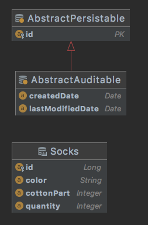

### Тестовое задание Java Bootcamp в Raiffeisen

[ТЗ](https://github.com/Raiffeisen-DGTL/cib-interns-test-task)

### Реализация
- Java 11
- Spring Boot
- PostgreSQL + Spring Data JPA + Liquibase
 

## Локальная сборка
#### Требования
- Docker + Docker compose
- Unix
#### Сборка
Из корня проекта запустите ./build.sh

## Heroku
[Swagger](https://hidden-coast-35368.herokuapp.com/swagger-ui/index.html?configUrl=/v3/api-docs/swagger-config)
 первый запуск может быть порядка 20 секунд (особенность бесплатной версии облачного сервиса)