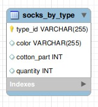

# Тестовое задание для Java стажеров

Привет!

А я тут задание для Java разработчиков сделал.

## API

URL, куда приходят запросы:

http://socks-application.herokuapp.com

Пример GET запроса:

http://socks-application.herokuapp.com/api/socks?color=yellow&operation=equal&cottonPart=80

POST Income:

http://socks-application.herokuapp.com/api/socks/income

POST Outcome:

http://socks-application.herokuapp.com/api/socks/outcome

Пример body для POST income/outcome запросов (в случае income quantity добавляет указанное кол-во 
носков, в случае outcome убавляет):

```json
{
    "color":"yellow",
    "cottonPart":80,
    "quantity":2000
}
```

## Список URL HTTP-методов есть в task.md

[task.md](task.md)

## Как это сделано?


Из самого основного: Java8 + MySQL (8.0, на heroku 5.6) + Spring Boot + Web + JPA. (+Flyway, но на heroku его нет, о чём ниже)

В качестве реляционной базы данных был использован MySQL, сама БД состоит из одной таблицы. 

Схема БД:



[SQL скрипт инициализации БД](src/main/resources/db/migration/V1__Init_DB.sql)

Для версионирования БД был использован фреймворк Flyway, но при развёртывании на Heroku оказалось, что там стоит слишком 
старая версия MySQL. В любом случае, Flyway можно включить, изменив application.properties с этого:

```properties
spring.datasource.url=${JDBC_DATABASE_URL:jdbc:mysql://localhost:3306/Socks}
spring.datasource.username=${JDBC_DATABASE_USERNAME:nezhov}
spring.datasource.password=${JDBC_DATABASE_PASSWORD:220501}
spring.datasource.driver-class-name=com.mysql.cj.jdbc.Driver
#logging.level.root=debug

spring.jpa.database=MYSQL
spring.jpa.show-sql=true


#when first time booting with jpa use string below, 
# but no need if using flyway
spring.jpa.hibernate.ddl-auto=create


#spring.jpa.hibernate.ddl-auto=validate
spring.flyway.enabled=false
server.port=${PORT:8080}
#uncomment if true,requires MySQL 5.7 or higher
#spring.flyway.url=jdbc:mysql://localhost:3306/Socks
#spring.flyway.user=nezhov
#spring.flyway.password=220501


```

На это:
```properties
spring.datasource.url=${JDBC_DATABASE_URL:jdbc:mysql://localhost:3306/Socks}
spring.datasource.username=${JDBC_DATABASE_USERNAME:nezhov}
spring.datasource.password=${JDBC_DATABASE_PASSWORD:220501}
spring.datasource.driver-class-name=com.mysql.cj.jdbc.Driver
#logging.level.root=debug

spring.jpa.database=MYSQL
spring.jpa.show-sql=true


#when first time booting with jpa use string below, but no need if using flyway
#spring.jpa.hibernate.ddl-auto=create


spring.jpa.hibernate.ddl-auto=validate
spring.flyway.enabled=true
server.port=${PORT:8080}
#uncomment if true,requires MySQL 5.7 or higher
spring.flyway.url=jdbc:mysql://localhost:3306/Socks
spring.flyway.user=nezhov
spring.flyway.password=220501

```

После этого для запуска докер контейнеров требуется ввести следующие команды:

```bash
sudo systemctl start mysql
mvn package
sudo systemctl stop mysql
docker-compose build
docker-compose up
```


## Почему на Heroku нет Flyway?

Для развёртывания на Heroku я установил аддон ClearDB MySQL, но оказалось, что там стоит версия MySQL 5.6. 

При развёртывании же на настоящем сервере был написан docker-compose.yml (в нём уже можно использовать Flyway), который 
был протестирован на локальной машине (оба контейнера поднимались корректно и без проблем, главное не забыть пересобрать 
пакет через maven после изменения application.properties).
