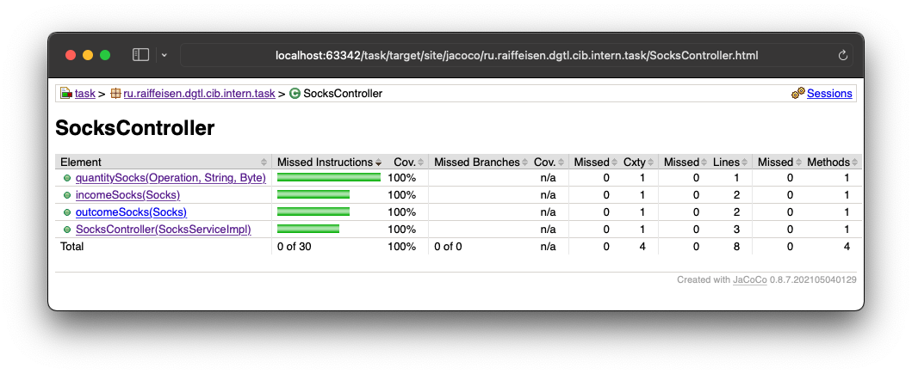

# Тестовое задание на стажировку Raiffeisenbank Java Bootcamp

Реализовать приложение (REST API) для автоматизации учёта носков на складе магазина.
Полный текст задания размещен по [ссылке](https://github.com/Raiffeisen-DGTL/cib-interns-test-task).

## Запуск
Для запуска приложения локально выполнить команду:
```sh
mvnw spring-boot:run
```

### Docker
Для запуска приложение в контейнере выполнить следующие команды:

```sh
mvnw spring-boot:build-image
docker run -p 8080:8080 -t task:0.0.1-SNAPSHOT
```

### Heroku
Так же приложение доступно по [ссылке](https://raiffeisenbank-test-task.herokuapp.com/api/socks?color=red&operation=equal&cottonPart=70).

## База данных
В реализации использовалась база данных [H2](https://www.h2database.com/html/main.html) (Memory Mode).

### Схема БД
Использовалась одна таблица БД, со следующими характеристиками:

### socks
Column | Тип | Default | Nullable
--- | --- | --- | --- 
COLOR [PK] | VARCHAR(255) | None| NO
COTTON_PART [PK] | TINYINT | None | NO
QUANTITY | BIGINT CHECK ("QUANTITY" >= 0) | None | NO

Так как не требовалось получать остатки на конкретный момент времени, 
в БД не хранится исторические данные поступления/выбытия носков. При поступлении носков выполняется проверка, есть ли же 
такая пара, если да то увеличивается количество. При выбытии реализован контроль остатка носков на складе.

## Тестирование
Реализованы тесты проверки корректности кодов ответа сервера.
Пример отчета по тестированию контроллера:

Запуск тестов выполнить команду:
```sh
mvnw test
```
Для просмотра результата тестирования выполнить команду:
```sh
open ./target/site/jacoco/index.html
```

## Контакты
Безрукавый Владимир - [Telegram](https://t.me/sleeveless) - bezrukaviy@gmail.com
