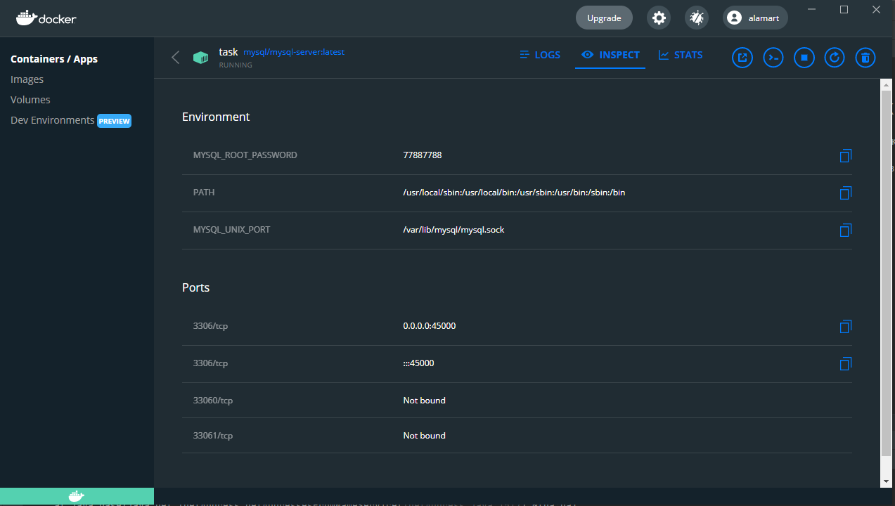

# Комментарии по выполнению задания
1. Задание выполнено с помощью Spring Framework
2. База данных - PostgreSQL
3. Приложение вместе с базой данных можно развернуть с помощью docker-compose.yml
4. API развернуто на Google Kubernetes Engine и доступно к вызову по адресу: http://35.230.56.172:8080/

Примеры post запросов:
http://35.230.56.172:8080/api/socks/income
JSON
{"color": "red","cottonPart":95,"quantity":2}
http://35.230.56.172:8080/api/socks/outcome
JSON
{"color": "red","cottonPart":95,"quantity":1}

Пример ответа после двух последовательных запросов из примера выше
url http://35.230.56.172:8080/api/socks?color=red&operation=equal&cottonPart=95

## Список URL HTTP-методов

### POST /api/socks/income

Регистрирует приход носков на склад.

Параметры запроса передаются в теле запроса в виде JSON-объекта со следующими атрибутами:

* color — цвет носков, строка (например, black, red, yellow);
* cottonPart — процентное содержание хлопка в составе носков, целое число от 0 до 100 (например, 30, 18, 42);
* quantity — количество пар носков, целое число больше 0.

Результаты:

* HTTP 200 — удалось добавить приход;
* HTTP 400 — параметры запроса отсутствуют или имеют некорректный формат;
* HTTP 500 — произошла ошибка, не зависящая от вызывающей стороны (например, база данных недоступна).

### POST /api/socks/outcome

Регистрирует отпуск носков со склада. Здесь параметры и результаты аналогичные, но общее количество носков указанного цвета и состава не увеличивается, а уменьшается.

### GET /api/socks

Возвращает общее количество носков на складе, соответствующих переданным в параметрах критериям запроса.

Параметры запроса передаются в URL:

* color — цвет носков, строка;
* operation — оператор сравнения значения количества хлопка в составе носков, одно значение из: moreThan, lessThan, equal;
* cottonPart — значение процента хлопка в составе носков из сравнения.

Результаты:

* HTTP 200 — запрос выполнен, результат в теле ответа в виде строкового представления целого числа;
* HTTP 400 — параметры запроса отсутствуют или имеют некорректный формат;
* HTTP 500 — произошла ошибка, не зависящая от вызывающей стороны (например, база данных недоступна).

Примеры запросов:

* /api/socks?color=red&operation=moreThan&cottonPart=90 — должен вернуть общее количество красных носков с долей хлопка более 90%;
* /api/socks?color=black&operation=lessThan?cottonPart=10 — должен вернуть общее количество черных носков с долей хлопка менее 10%.

